# CMMC Intune BYOD Data Protection Lab

## Overview

This hands-on lab demonstrates how Microsoft Intune Mobile Application Management (MAM) can be used to protect organizational data accessed from personally owned mobile devices (BYOD).

The lab focuses on Microsoft Teams and demonstrates how an organization can allow authorized users to access corporate resources while restricting how organizational data can leave the managed application boundary.

The solution was configured using Microsoft Entra ID and Microsoft Intune and validated on a physical iOS device.

> **Lab Disclaimer:** No production data or actual Controlled Unclassified Information (CUI) was used. All accounts, data, and scenarios in this project were created specifically for lab testing.

---

## Security Scenario

An organization allows employees to access Microsoft Teams from personally owned mobile devices.

This creates potential data-exfiltration risks, including:

- Copying organizational data into personal applications
- Taking screenshots of organizational information
- Screen recording
- Saving organizational data to personal storage
- Sharing organizational information with unmanaged applications
- Accessing organizational resources from compromised mobile devices

### Security Objective

Allow authorized BYOD access to Microsoft Teams while restricting the movement of organizational data outside approved application boundaries.

---

## Technologies Used

- Microsoft Entra ID
- Microsoft Intune
- Microsoft Teams
- Microsoft 365
- Intune Mobile Application Management (MAM)
- iOS/iPadOS
- Android

---

## Lab Architecture

```text
Microsoft Entra ID
        |
        v
GRP-CMMC-AC-MAM-Lab
        |
        v
Microsoft Intune
App Protection Policy
        |
        v
Microsoft Teams
        |
        v
BYOD Device
   /          \
Android      iOS
        |
        v
Protected Organizational Data
```
---

## Implementation

### 1. Test User and Licensing

A dedicated lab user was created and licensed to validate the Intune MAM configuration without using production accounts or data.

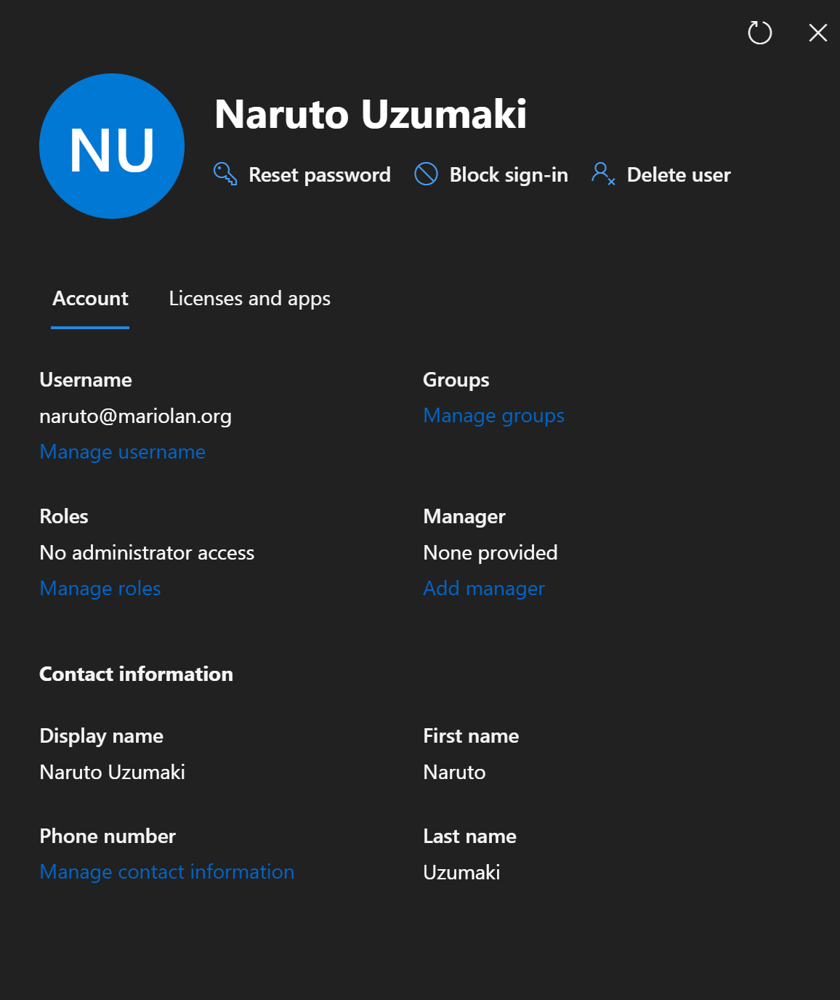

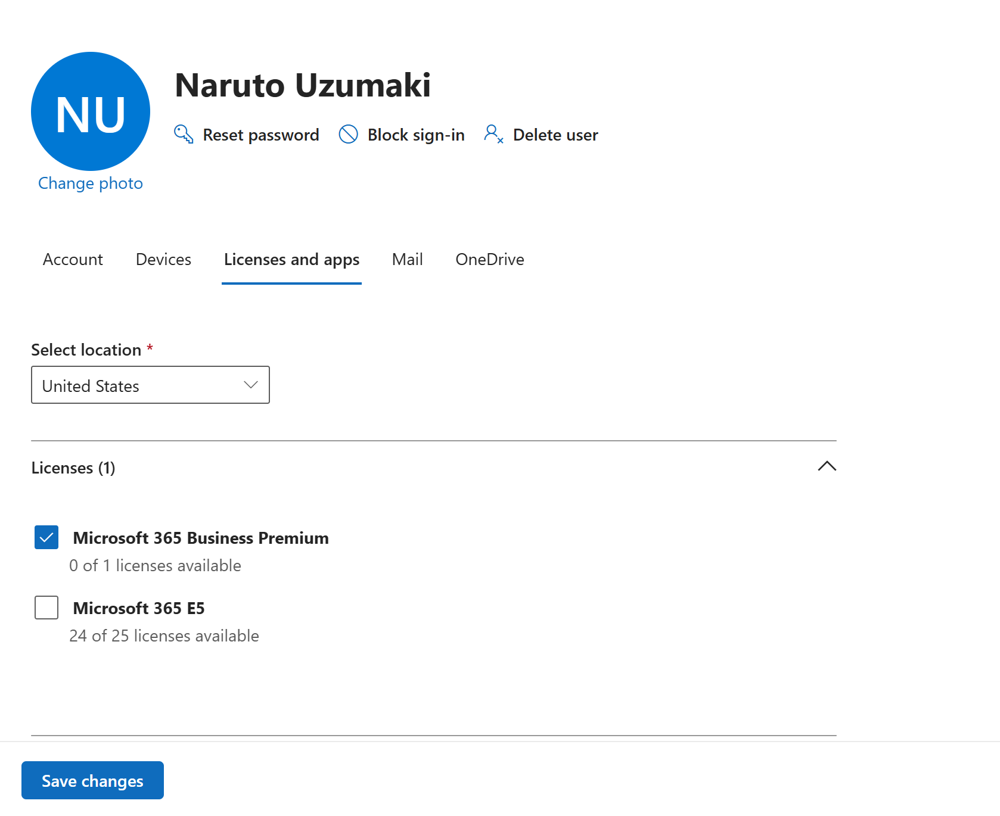

### 2. MAM Security Group

A dedicated Microsoft Entra ID group was created to scope the App Protection Policy to authorized lab users.

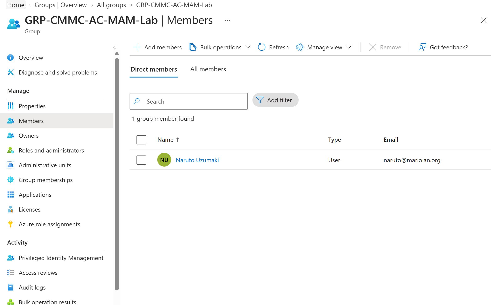

### 3. App Protection Policy

Microsoft Intune App Protection Policies were configured for BYOD mobile devices. Microsoft Teams was selected as the protected application.

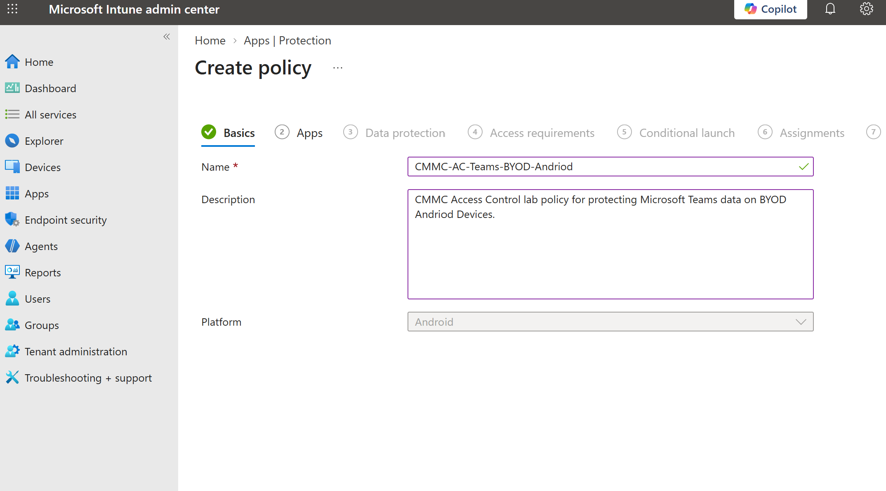

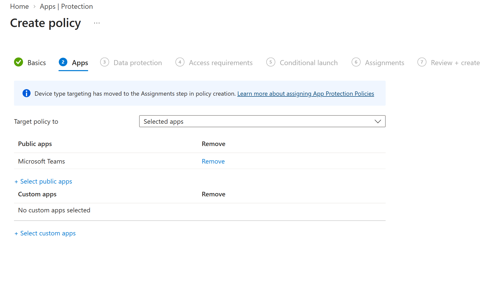

### 4. Access Requirements

Application access controls were configured to require an app PIN and enforce additional authentication protections before organizational data can be accessed.

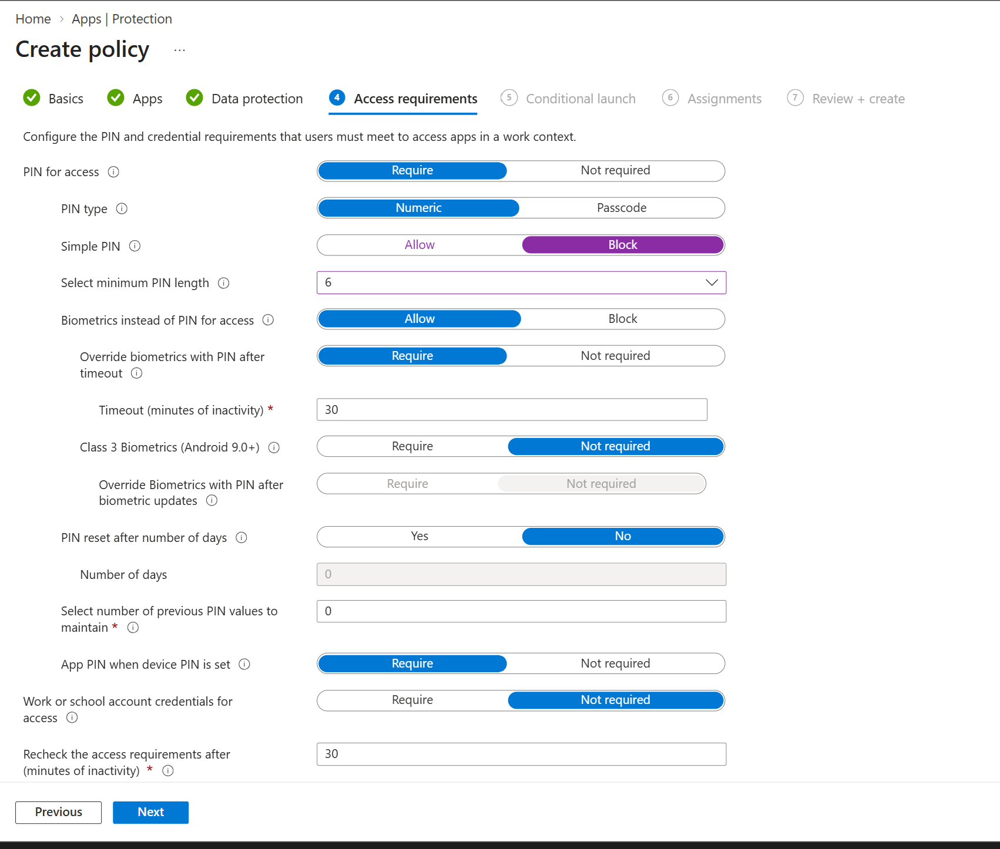

### 5. Conditional Launch

Conditional launch controls were configured to restrict access when device or application security requirements are not satisfied.

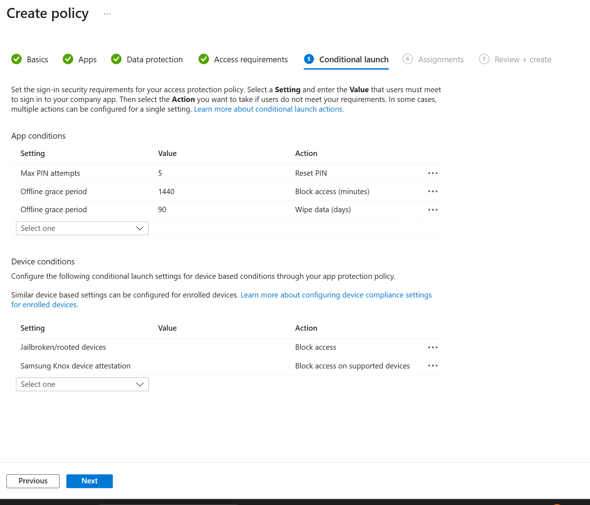

### 6. Policy Assignment

The App Protection Policy was assigned to the dedicated MAM lab security group.

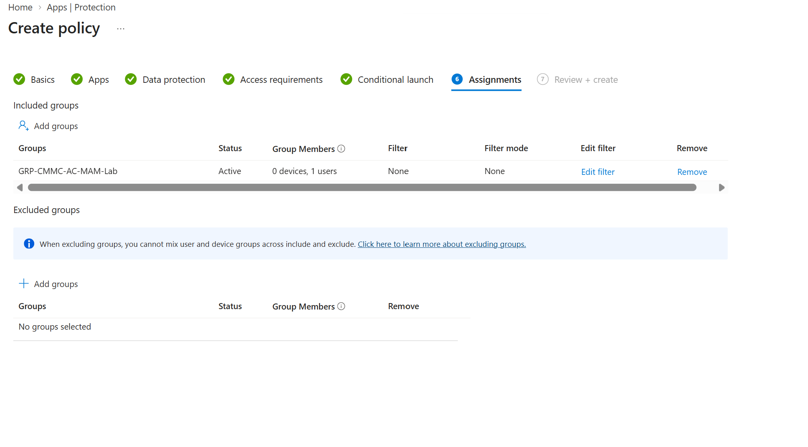

### 7. Policy Review

The completed policy configuration was reviewed before deployment.

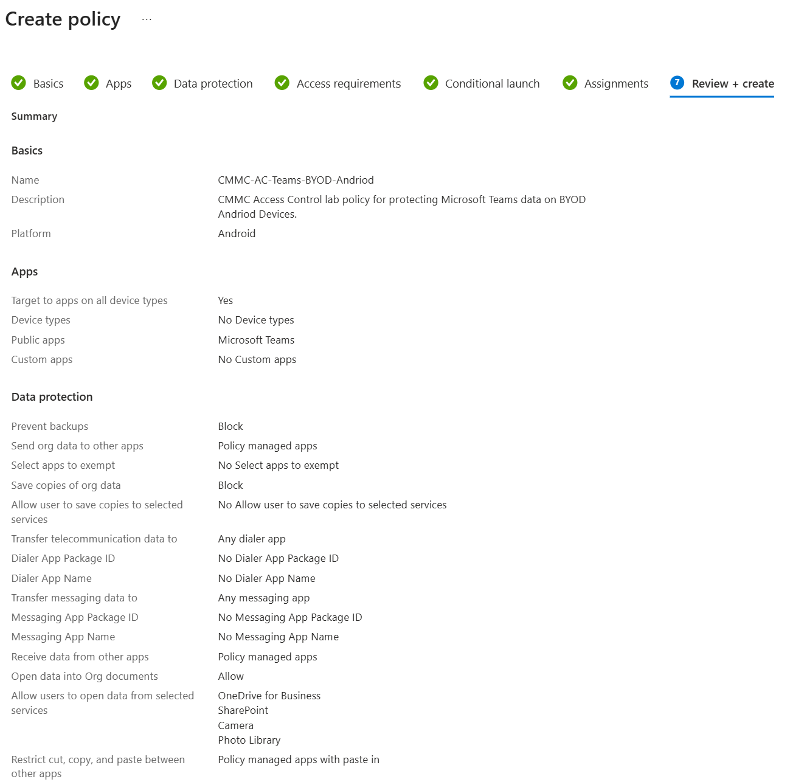

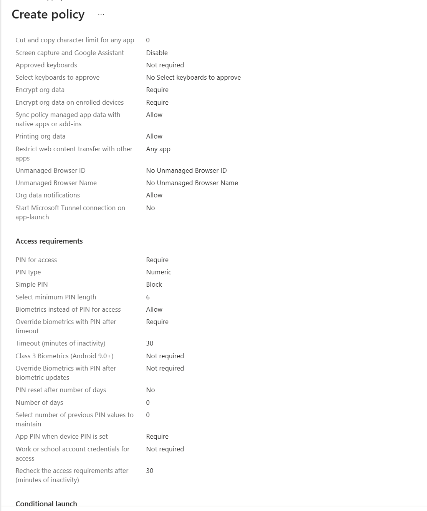

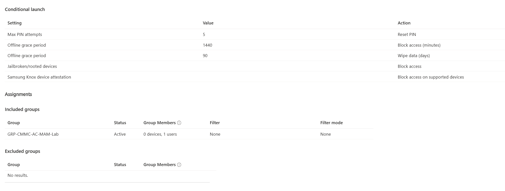

---

## Validation Testing

The policy was validated on a physical BYOD iPhone using Microsoft Teams.

### Screen Capture Protection

Attempting to capture protected organizational content resulted in the content being obscured, demonstrating enforcement of the configured data protection control.

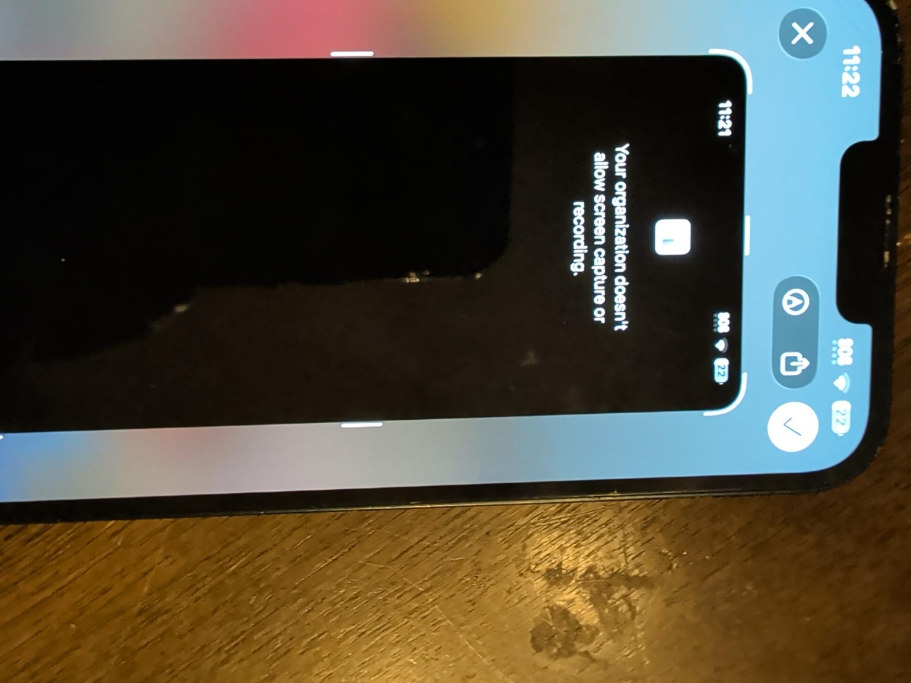

### Copy and Paste Protection

Organizational data copied from the managed Microsoft Teams environment could not be pasted into an unmanaged personal application.

The device displayed:

> **Your organization's data cannot be pasted here.**

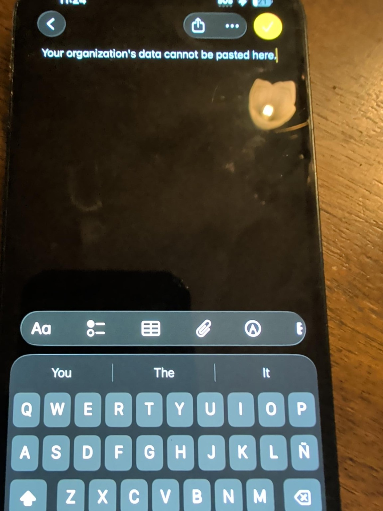

These tests demonstrate that Intune MAM can enforce application-level data protection controls on personally owned devices without requiring full device enrollment.

---

## CMMC Relevance

This lab demonstrates technical concepts that support CMMC 2.0 Access Control and data protection objectives in a BYOD scenario.

Relevant security concepts demonstrated include:

- Restricting access to organizational information to authorized users
- Controlling the flow of organizational data between managed and unmanaged applications
- Preventing unauthorized copying and pasting of organizational information
- Restricting screen capture and screen recording of protected application data
- Applying application-level security controls to personally owned mobile devices
- Blocking access from devices that fail defined security conditions

> **Note:** This lab demonstrates security controls that can support an organization's CMMC implementation. The configuration shown does not, by itself, establish CMMC compliance.

---

## Key Takeaways

This project provided hands-on experience with:

- Microsoft Intune Mobile Application Management (MAM)
- App Protection Policies
- Microsoft Entra ID security group scoping
- BYOD security architecture
- Application-level data loss prevention
- Conditional launch controls
- iOS policy validation
- Security control testing and evidence collection
- Applying Microsoft 365 security technologies to CMMC-related security objectives

## Validation Result

**Result: Successful**

The configured Intune App Protection Policy successfully restricted organizational data movement on the tested iOS BYOD device.

Testing confirmed that protected Microsoft Teams data could not be copied into an unmanaged personal application and that screen capture/recording of protected organizational content was restricted.
